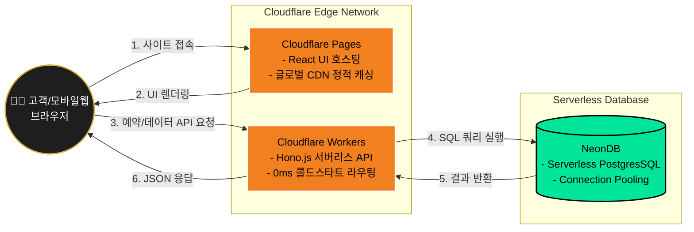

# 바버샵 클라우드플레어(Cloudflare) 통합 배포 아키텍처
**작성일시:** 2026년 3월 3일 14:12

코드 작성 전에 확정 짓는 **Cloudflare 생태계 기반 Vercel/AWS 대안 100% 서버리스 엣지(Edge) 인프라 구축 방안**입니다.

## 🚀 1. 배포 분리 전략 (Frontend vs Backend)

이 프로젝트는 속도와 비용 효율을 극대화하기 위해 프론트와 백을 완전히 분리하여 Cloudflare 네트워크에 올립니다.

| 영역 | 사용 기술 | Cloudflare 서비스 | 로컬 개발 명령어 | 프로덕션 배포 명령어 |
| :--- | :--- | :--- | :--- | :--- |
| **Frontend** | React (Vite 빌드 기반) | **Cloudflare Pages** | `npm run dev` | `npm run build` 후 `wrangler pages deploy dist` |
| **Backend** | Hono.js (API 서버) | **Cloudflare Workers** | `npm run dev` (Wrangler 로컬 에뮬레이터) | `npm run deploy` (Wrangler 내부 스크립트) |

---

## 🛠️ 2. 데이터베이스 및 엣지 연동 구조도

세계 어디서든 빠르게 접속 가능한 아키텍처 설계도입니다.



---

## 🔒 3. 환경 변수 (Secrets) 관리 방안

Cloudflare 배포 시 코드에 직접 노출되면 안 되는 보안 키 관리 원칙입니다. `Hono` 환경에서 `Bindings` 타입으로 주입받아 사용합니다.

1.  **DATABASE_URL**: NeonDB Postgres 접속 문자열 (로컬 `.dev.vars` / 실서버 `wrangler secret put`)
2.  **JWT_SECRET**: 사용자 로그인 유지 및 권한 제어용 서명 비밀키

---

## ⚙️ 4. 백엔드 (Workers) `wrangler.toml` 배포 설정 명세서

추후 API 배포를 위해 적용할 설정값 기획입니다. (코드 생성 전 도면)

```toml
# e:/HAIRSHOP/backend/wrangler.toml 예정 내용
name = "barbershop-api"
main = "src/index.ts"
compatibility_date = "2024-03-03" # 호환성 날짜 지정 필수

# 연결할 DB 설정 (환경변수는 secret으로 안전하게 외부 격리)
[vars]
# DATABASE_URL = "" 
```
