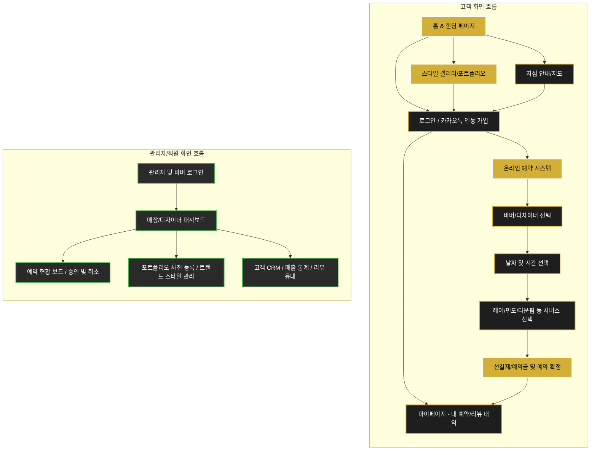

# 바버샵 웹 앱 서비스 플로우차트
**작성일시:** 2026년 3월 3일 13:16

```mermaid
graph TD
    classDef default fill:#1e1e1e,stroke:#d4af37,stroke-width:2px,color:#fff;
    classDef highlight fill:#d4af37,stroke:#fff,stroke-width:2px,color:#000;
    classDef admin fill:#2a2a2a,stroke:#4caf50,stroke-width:2px,color:#fff;

    %% 고객 플로우
    subgraph Client Flow [고객 화면 흐름]
        direction TB
        Home[홈 & 랜딩 페이지] --> Portfolio[스타일 갤러리/포트폴리오]
        Home --> Map[지점 안내/지도]
        Home --> Auth[로그인 / 카카오톡 연동 가입]
        
        Portfolio --> Auth
        Map --> Auth
        
        Auth --> MyPage[마이페이지 - 내 예약/리뷰 내역]
        Auth --> Booking[온라인 예약 시스템]
        
        Booking --> SelectDesigner[바버/디자이너 선택]
        SelectDesigner --> SelectTime[날짜 및 시간 선택]
        SelectTime --> SelectService[헤어/면도/다운펌 등 서비스 선택]
        SelectService --> Payment[선결제/예약금 및 예약 확정]
        Payment --> MyPage
    end

    %% 관리자 플로우
    subgraph Admin Flow [관리자/직원 화면 흐름]
        direction TB
        AdminAuth[관리자 및 바버 로그인] --> AdminDash[매장/디자이너 대시보드]
        AdminDash --> ManageBooking[예약 현황 보드 / 승인 및 취소]
        AdminDash --> ManageStyle[포트폴리오 사진 등록 / 트렌드 스타일 관리]
        AdminDash --> ManageUser[고객 CRM / 매출 통계 / 리뷰 응대]
    end

    class Home,Portfolio,Booking,Payment highlight;
    class AdminAuth,AdminDash,ManageBooking,ManageStyle,ManageUser admin;
```
