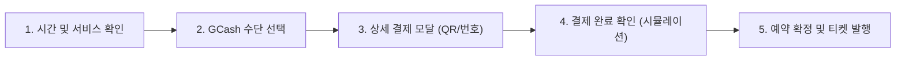

2# 💳 GCash Payment UX/UI Evolution Proposal

GCash 결제를 단순한 버튼 클릭이 아닌, 필리핀 현지 고객들이 가장 신뢰하고 편리하게 느낄 수 있는 **'프리미엄 결제 경험'**으로 디자인하기 위한 제안서입니다.

---

## 🔄 1. 상세 결제 프로세스 (Detailed Payment Flow)

사용자가 예약을 확정하기까지의 매끄러운 5단계 플로우를 제안합니다.

### 단계별 상세 경험
1.  **결제 정보 요약**: 선택한 디자이너, 날짜, 시간, 그리고 서비스 금액을 명확하게 브리핑합니다.
2.  **방법 선택**: GCash 로고가 강조된 전용 버튼 제공 (현재 구현된 UI의 고도화 버전).
3.  **상세 브릿지 페이지**:
    - **QR Code 스캔**: 배경이 흐려지는 Glassmorphism 모달 위에 고해상도 QR 제공.
    - **Mobile Number**: 매장의 GCash 번호를 원클릭으로 복사할 수 있는 기능.
    - **입금 확인(Proof of Payment)**: 사용자가 입금 후 스크린샷을 업로드하거나 Reference Number를 입력할 수 있는 필드 제공.
4.  **실시간 검증 애니메이션**: "결제 확인 중..."이라는 문구와 함께 부드러운 로딩 애니메이션 노출.
5.  **디지털 티켓 발행**: 영수증 형태의 예쁜 디지털 티켓을 화면에 보여주며 '내 예약'으로 연결.

---

## 🎨 2. 디자인 아이디어 (Premium Design Assets)

### 시각적 테마: "GCash Blue + Premium Gold"
- **Color Palette**: GCash의 상징색(#007DFE)을 메인으로 하되, K-Barber의 럭셔리한 느낌을 위해 **Gold(#D4AF37)** 포인트를 융합합니다.
- **Glassmorphism**: 뒷배경을 블러 처리하고 반투명한 화이트/블루 카드를 사용하여 최신 트렌드 반영.
- **Micro-interactions**: 버튼 클릭 시 물결 효과(Ripple effect), 결제 완료 시 폭죽 애니메이션(Lottie 사용 권장).

### 주요 UI 요소 아이디어
- **Dynamic QR 카드**: 스캔하기 편하도록 중앙에 배치된 화이트 카드 UI.
- **Reference Number 입력 필드**: 필리핀 사용자들이 가장 익숙해하는 '번호 8자리 입력' 인터페이스.
- **실시간 상담 플로팅 버튼**: 결제가 어려울 경우 바로 매장과 연락할 수 있는 Viber/WhatsApp 숏컷 아이콘.

---

## 💡 3. 사용자 경험(UX) 최적화 포인트

1.  **신뢰도 기반 문구**: "Safe & Secured via GCash"와 같은 신뢰성 문구 배치.
2.  **타임아웃 가이드**: "10분 내에 입금이 확인되지 않으면 예약이 자동 취소됩니다"라는 안내로 긴박감과 명확성 부여.
3.  **오프라인 연동**: 매장에 도착했을 때 보여줄 수 있는 '결제 완료 QR 티켓'을 즉시 발권.
4.  **프로모션 알림**: "GCash 결제 시 오늘 50페소 즉시 할인!"과 같은 마케팅 배지 부착.

---

> [!IMPORTANT]
> **이 디자인 제안은 코드 구현 전 단계입니다.** 
> 이 플로우와 디자인 방향성에 동의하신다면, 가장 먼저 **상세 결제 모달(QR 및 입력 필드)**부터 순차적으로 구현을 시작할 수 있습니다. 어떤 포인트가 가장 마음에 드시나요?

**제안일**: 2026-03-04 07:44
**작성자**: Antigravity UX/UI Team
